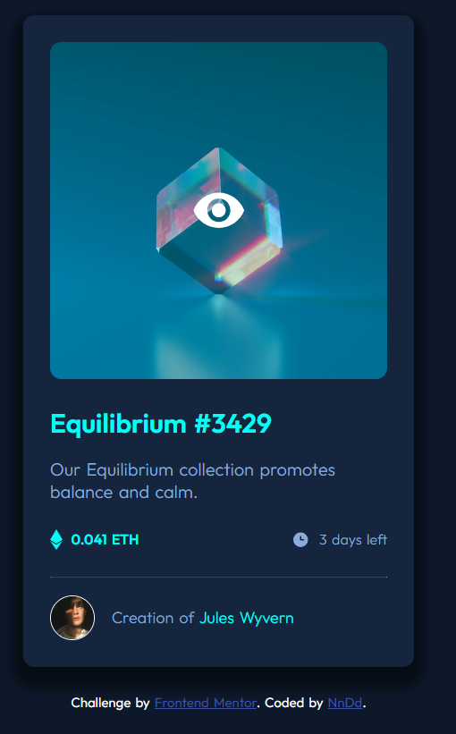

# Frontend Mentor - NFT preview card component solution

This is a solution to the [NFT preview card component challenge on Frontend Mentor](https://www.frontendmentor.io/challenges/nft-preview-card-component-SbdUL_w0U). Frontend Mentor challenges help you improve your coding skills by building realistic projects. 

## Table of contents

- [Overview](#overview)
  - [The challenge](#the-challenge)
  - [Screenshot](#screenshot)
  - [Links](#links)
- [My process](#my-process)
  - [Built with](#built-with)
  - [What I learned](#what-i-learned)
- [Author](#author)

## Overview

### The challenge

Users should be able to:

- View the optimal layout depending on their device's screen size
- See hover states for interactive elements

### Screenshot




### Links

- Solution URL: [Solution URL](https://github.com/Nn-Dd/NFTPreviewCard_Component)
- Live Site URL: [Live site URL](https://nn-dd.github.io/NFTPreviewCard_Component/)

## My process

### Built with

- Semantic HTML5 markup
- CSS custom properties
- Flexbox

### What I learned

I've learned a lot about image overlays

To see how you can add code snippets, see below:

```css
.proud-of-this-css {
  color: papayawhip;
}
```

## Author

- Website - [My GitHub Profile](https://github.com/Nn-Dd)
- Frontend Mentor - [@NnDd](https://www.frontendmentor.io/profile/Nn-Dd)

